# Jungle Cafe Website

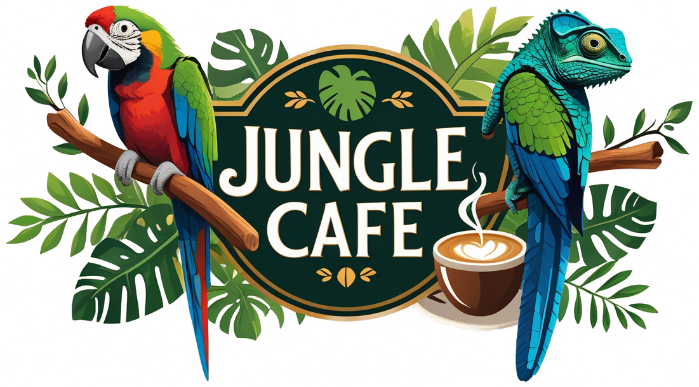

Final project for TIN (Internet Technologies) class at PJATK (V semester)

## Project Description

Jungle Cafe is a unique cafe experience where customers can enjoy their favorite beverages and meals while being surrounded by exotic animals. This web application provides an online platform for customers to view the menu, book tables, and stay updated on upcoming events.

### Key Features

#### 🌿 Immersive User Experience
The website offers a seamless, jungle-themed interface that captures the unique atmosphere of the cafe.

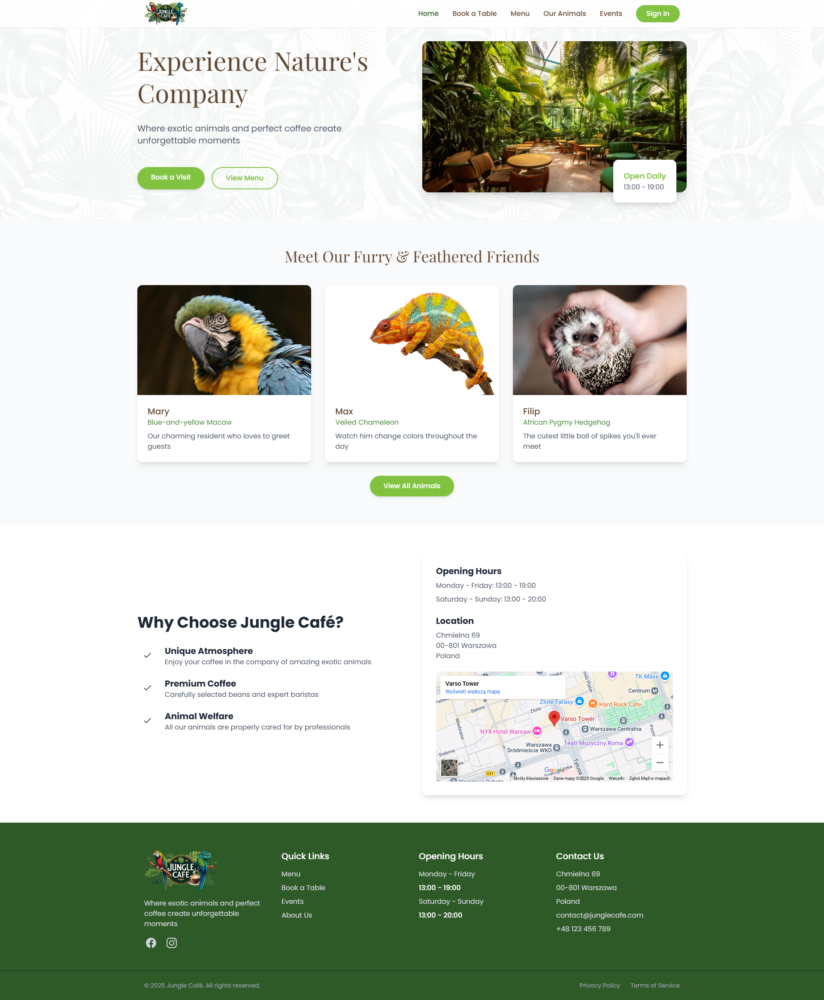

#### 🦁 Animal Gallery
- Expandable gallery of animal images with descriptions and facts
- Showcases the exotic animals residing in the cafe
- Detailed information about each animal's species, habitat, and fun facts

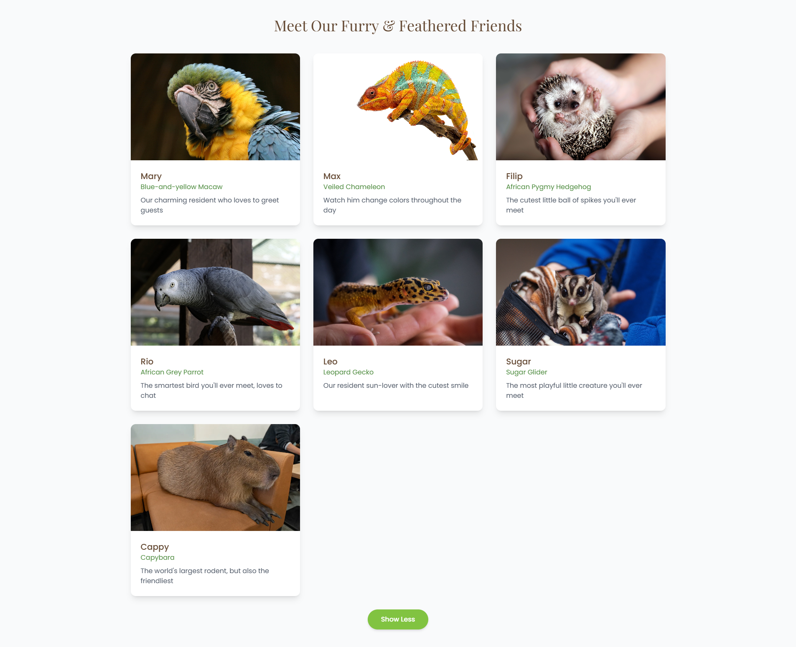

#### 🔐 User Authentication and Authorization
- Secure registration and login system
- Role-based access control (Customer, Employee, Admin)
- Profile management with personal information and preferences
- Password reset functionality
- JWT-based authentication for API endpoints

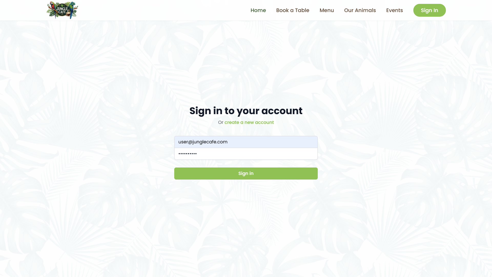
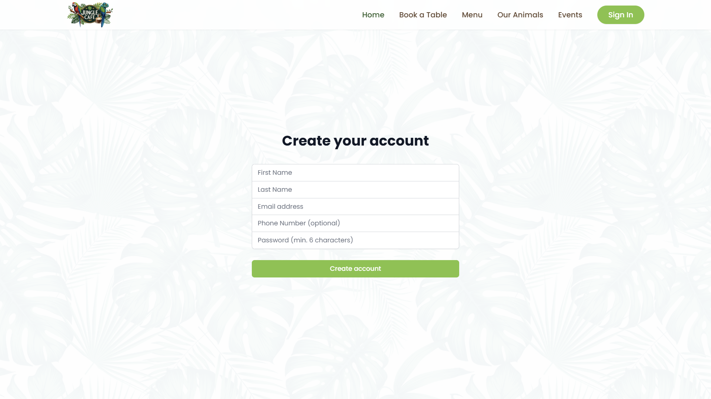

#### 🍽️ Interactive Menu
- Categorized display of food and beverages
- Detailed item descriptions with ingredients and allergen information
- Visual gallery of menu items

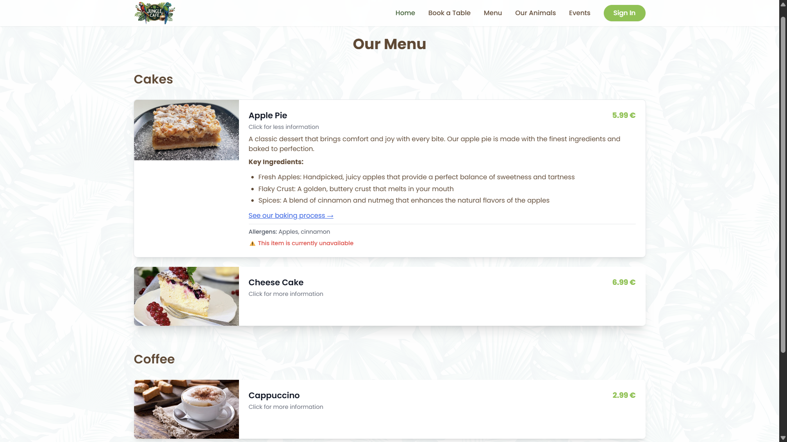

#### 🗓️ Table Reservation System
- Interactive calendar showing available slots
- Table selection based on preferences (location, size, proximity to animals)
- Ability to modify or cancel existing reservations
- Special requests field for custom arrangements

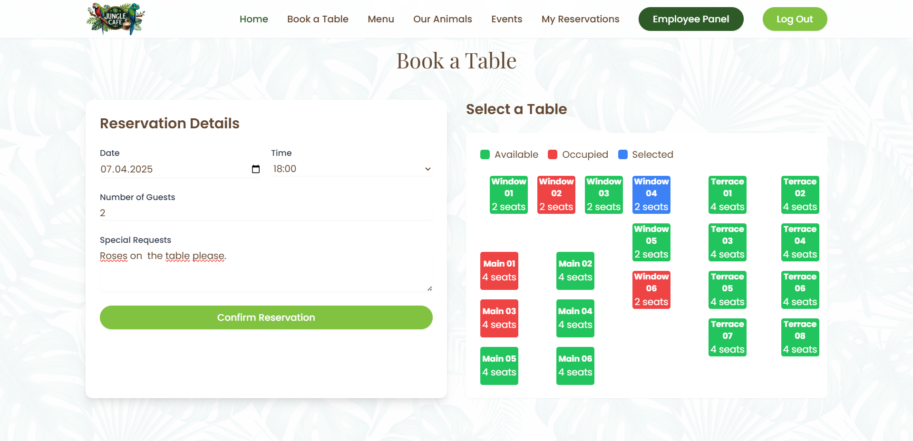

#### 📅 Event Management
- Calendar of upcoming events at the cafe
- Event registration and ticketing
- Detailed event information with schedule and highlights
- Past event gallery with photos and highlights

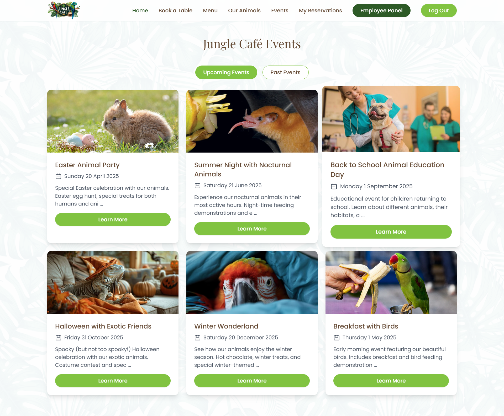
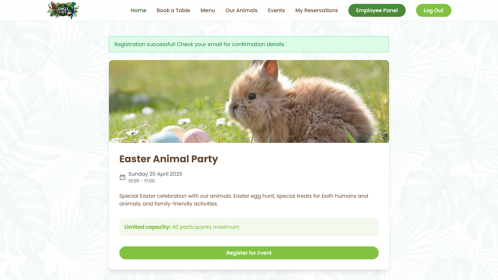
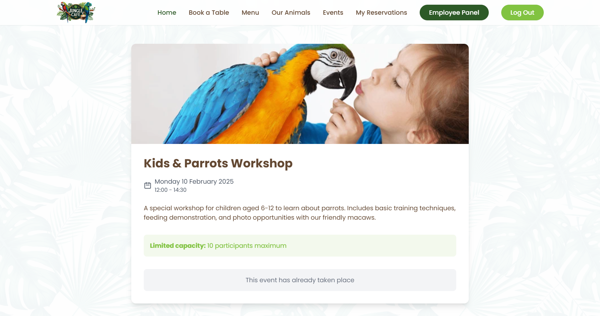

#### 👨💼 Employee Panel
- Dashboard for staff to manage daily operations
- Reservations, events, menu items and animals management interfaces
- Different permissions based on roles:
  - Admin: Full access to all features
  - Manager: Menu Management, Events Management, Reservations Management, Animals Management
  - Employee: Menu Management, Events Management, Reservations Management
  - Caretaker: Animal Management

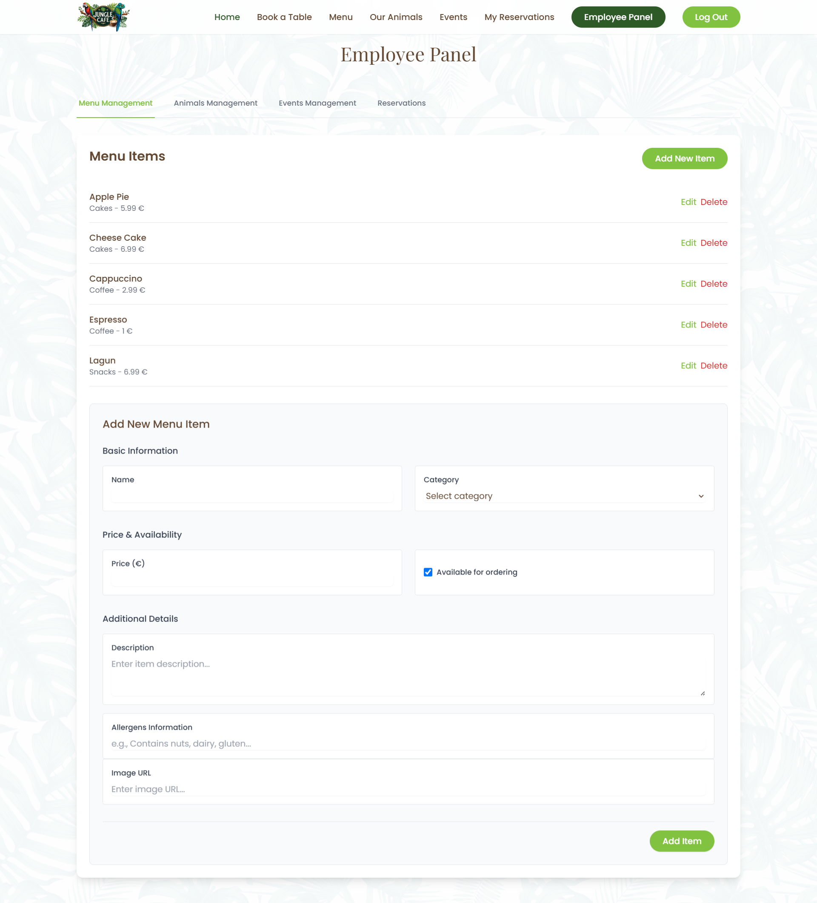
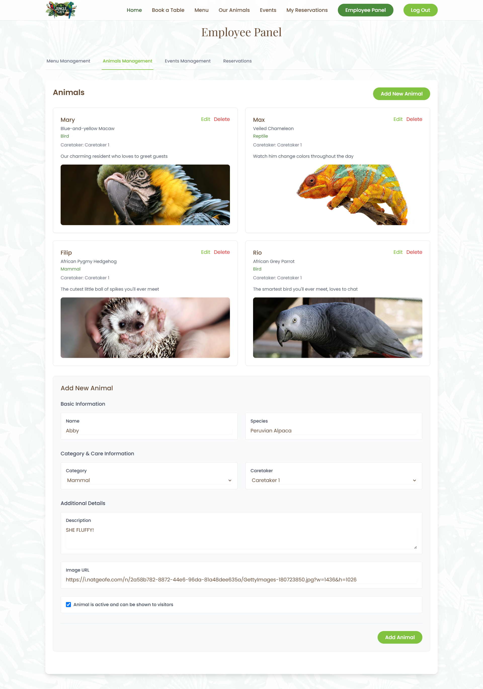
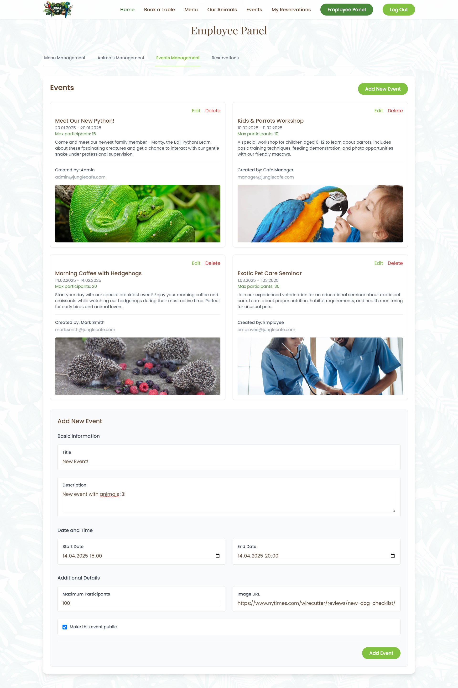
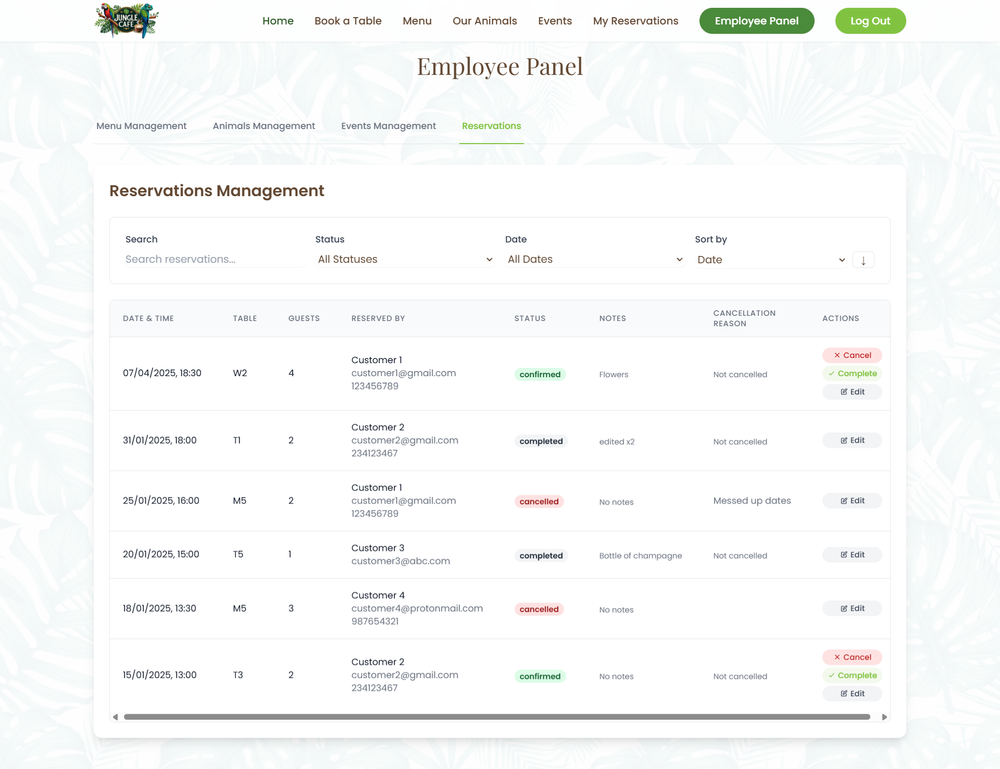

#### 📱 Responsive Design
- Fully responsive interface that works seamlessly across devices (desktop, tablet, mobile)
- Optimized layouts for different screen sizes
- Touch-friendly interface elements

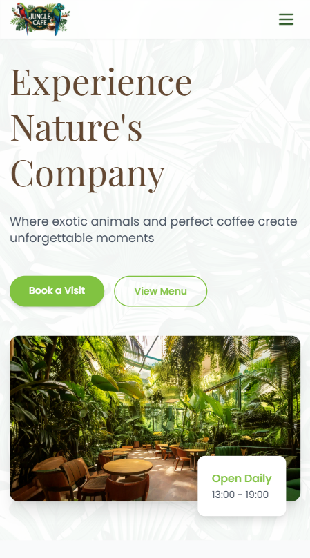
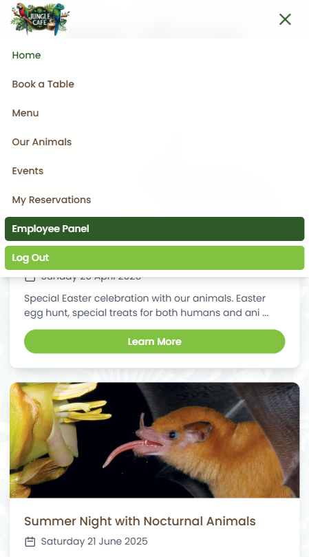

## Technical Implementation

### Frontend Architecture
The frontend is built with Svelte and uses a component-based architecture for maximum reusability and maintainability:

- **Component Library**: Custom UI components developed for consistent look and feel
- **State Management**: Leverages Svelte stores for reactive state management
- **Routing**: Client-side routing with Svelte Routing
- **Styling**: Utilizes Tailwind CSS for utility-first styling approach
- **Responsive Design**: Mobile-first approach ensuring compatibility across devices
- **API Integration**: Axios for REST API communication with backend services

### Backend Architecture
The backend follows a clean architecture approach with separation of concerns:

- **API Layer**: RESTful controllers handling HTTP requests and responses
- **Service Layer**: Business logic implementation
- **Data Access Layer**: Entity Framework Core for database operations
- **Authentication**: JWT-based authentication and authorization
- **Validation**: Request model validation using data annotations and FluentValidation
- **Documentation**: Swagger UI for API documentation and testing

### Database Schema
The application uses SQL Server with the following key entities:

- **Users**: Stores user accounts with role-based access control
- **Animals**: Information about the exotic animals in the cafe
- **Menu Items**: Food and beverages available for order
- **Tables**: Cafe seating arrangements with capacity information
- **Reservations**: Customer table bookings with date, time, and guest count
- **Events**: Upcoming special events at the cafe

## Setup Instructions

### Prerequisites
- Node.js (v14 or higher)
- npm (v6 or higher)
- .NET 8 SDK
- SQL Server

### Installation Steps
1. Clone the repository:
   ```bash
   git clone https://github.com/Szafranee/jungle-cafe-website.git
   cd jungle-cafe-website
   ```

2. Install client dependencies:
   ```bash
   cd JungleCafe.Client
   npm install
   ```

3. Install server dependencies:
   ```bash
   cd ../JungleCafe.Server
   dotnet restore
   ```

4. Set up the database:
   - Create a new SQL Server database.
   - Update the connection string in `appsettings.json` with your database details.

5. Apply database migrations:
   ```bash
   dotnet ef database update
   ```

6. Run the project locally:
   - Start the server:
     ```bash
     cd JungleCafe.Server
     dotnet run
     ```
   - Start the client:
     ```bash
     cd ../JungleCafe.Client
     npm run dev
     ```

7. Access the application:
   - Frontend: http://localhost:5173
   - API: http://localhost:5000
   - Swagger UI: http://localhost:5000/swagger

## API Documentation

The API provides endpoints for managing all aspects of the Jungle Cafe experience. Below are the key API categories:

### 🦁 Animals API

| Endpoint | Method | Description | Authentication |
|----------|--------|-------------|----------------|
| `/api/animals` | GET | Retrieve all animals | None |
| `/api/animals/{id}` | GET | Get animal by ID | None |
| `/api/animals` | POST | Create new animal | Required (Admin) |
| `/api/animals/{id}` | PUT | Update animal | Required (Admin) |
| `/api/animals/{id}` | DELETE | Remove animal | Required (Admin) |

Example request for creating an animal:
```bash
curl -X POST https://your-api-url/api/animals \
  -H "Authorization: Bearer <token>" \
  -H "Content-Type: application/json" \
  -d '{"name": "Lion", "species": "Panthera leo", "category": "Mammal", "imageUrl": "https://example.com/lion.jpg"}'
```

### 📅 Events API

| Endpoint | Method | Description | Authentication |
|----------|--------|-------------|----------------|
| `/api/events` | GET | Retrieve all events | None |
| `/api/events/{id}` | GET | Get event by ID | None |
| `/api/events` | POST | Create new event | Required (Admin) |
| `/api/events/{id}` | PUT | Update event | Required (Admin) |
| `/api/events/{id}` | DELETE | Remove event | Required (Admin) |
| `/api/events/{id}/register` | POST | Register for event | Required (User) |

### 🍽️ Menu API

| Endpoint | Method | Description | Authentication |
|----------|--------|-------------|----------------|
| `/api/menu` | GET | Retrieve all menu items | None |
| `/api/menu/categories` | GET | Get menu categories | None |
| `/api/menu/{id}` | GET | Get menu item by ID | None |
| `/api/menu` | POST | Create menu item | Required (Admin) |
| `/api/menu/{id}` | PUT | Update menu item | Required (Admin) |
| `/api/menu/{id}` | DELETE | Remove menu item | Required (Admin) |

### 🗓️ Reservations API

| Endpoint | Method | Description | Authentication |
|----------|--------|-------------|----------------|
| `/api/reservations` | GET | Get user reservations | Required (User) |
| `/api/reservations/all` | GET | Get all reservations | Required (Admin) |
| `/api/reservations/{id}` | GET | Get reservation by ID | Required (User/Admin) |
| `/api/reservations` | POST | Create reservation | Required (User) |
| `/api/reservations/{id}` | PUT | Update reservation | Required (User) |
| `/api/reservations/{id}` | DELETE | Cancel reservation | Required (User) |

### 🪑 Tables API

| Endpoint | Method | Description | Authentication |
|----------|--------|-------------|----------------|
| `/api/tables` | GET | Get all tables | None |
| `/api/tables/available` | GET | Get available tables | None |
| `/api/tables/{id}` | GET | Get table by ID | None |
| `/api/tables` | POST | Create table | Required (Admin) |
| `/api/tables/{id}` | PUT | Update table | Required (Admin) |
| `/api/tables/{id}` | DELETE | Remove table | Required (Admin) |

### 👤 Users API

| Endpoint | Method | Description | Authentication |
|----------|--------|-------------|----------------|
| `/api/users` | GET | Get all users | Required (Admin) |
| `/api/users/{id}` | GET | Get user by ID | Required (Self/Admin) |
| `/api/users/{id}` | PUT | Update user | Required (Self/Admin) |
| `/api/users/{id}` | DELETE | Delete user | Required (Self/Admin) |

### 🔐 Authentication API

| Endpoint | Method | Description | Authentication |
|----------|--------|-------------|----------------|
| `/api/auth/register` | POST | Register new user | None |
| `/api/auth/login` | POST | Login | None |
| `/api/auth/refresh` | POST | Refresh token | None |

## Dependencies

### Client Dependencies
- **Svelte**: Frontend framework
- **Vite**: Build tool and development server
- **Tailwind CSS**: Utility-first CSS framework
- **Svelte Routing**: Client-side routing
- **Marked**: Markdown parsing library
- **Axios**: HTTP client
- **Day.js**: Date manipulation library
- **Svelte-Toasts**: Notification system

### Server Dependencies
- **.NET 8**: Web application framework
- **Entity Framework Core**: ORM for database operations
- **Microsoft IdentityModel Tokens**: JWT authentication
- **Swashbuckle**: Swagger UI implementation
- **AutoMapper**: Object-to-object mapping
- **FluentValidation**: Request validation

## Deployment Instructions

### Azure Deployment
1. Build the client:
   ```bash
   cd JungleCafe.Client
   npm run build
   ```

2. Publish the server:
   ```bash
   cd ../JungleCafe.Server
   dotnet publish -c Release -o ./publish
   ```

3. Deploy to Azure App Service:
   - Create an Azure App Service
   - Set up deployment from GitHub or upload manually
   - Configure environment variables for database connection

### Docker Deployment
1. Build the Docker images:
   ```bash
   docker-compose build
   ```

2. Run the containers:
   ```bash
   docker-compose up -d
   ```

## Contributing

We welcome contributions to the Jungle Cafe Website! Please follow these steps:

1. Fork the repository
2. Create a feature branch (`git checkout -b feature/amazing-feature`)
3. Commit your changes (`git commit -m 'Add some amazing feature'`)
4. Push to the branch (`git push origin feature/amazing-feature`)
5. Open a Pull Request

## Project Architecture and Directory Structure

The project follows a clean separation between frontend and backend:

### Frontend Structure (`JungleCafe.Client`)
```
JungleCafe.Client/
├── public/              # Static files
│   └── img/             # Image assets
├── src/
│   ├── assets/          # Frontend assets
│   ├── lib/             # Utilities and libraries
│   │   ├── Components/  # Reusable UI components
│   │   │   ├── Auth/    # Authentication components
│   │   │   ├── Employee/ # Employee dashboard components
│   │   │   ├── Events/  # Event management components
│   │   │   ├── Main/    # Main page components
│   │   │   ├── Menu/    # Menu display components
│   │   │   ├── NotFound/ # 404 page components
│   │   │   ├── Reservations/ # Reservation system components
│   │   │   └── UserReservations/ # User reservations components
│   │   └── stores/      # Svelte stores for state management
│   ├── App.svelte       # Root component
│   └── main.js          # Entry point
└── package.json         # Dependencies and scripts
```

### Backend Structure (`JungleCafe.Server`)
```
JungleCafe.Server/
├── Controllers/         # API endpoints
├── DTOs/                # Data transfer objects
├── Models/              # Database entities
├── Properties/          # Project properties
├── RequestModels/       # API request models
├── ResponseModels/      # API response models
├── Services/            # Business logic
│   └── Interfaces/      # Service contracts
└── Program.cs           # Application entry point
```

## Project Root Structure
```
jungle-cafe-website/
├── docs/                # Documentation
│   └── images/             # Documentation images
├── JungleCafe.Client/   # Frontend application (Svelte)
├── JungleCafe.Server/   # Backend application (.NET)
├── JungleCafe.sln       # Solution file
├── LICENSE              # License file
└── README.md            # Project documentation
```

## License

This project is licensed under the MIT License - see the LICENSE file for details.

## Acknowledgments

- Special thanks to PJATK for the opportunity to develop this project
- The Svelte and .NET communities for their excellent documentation and resources
- All contributors who have helped shape this project

## Contact

Project Link: [https://github.com/Szafranee/JungleCafe](https://github.com/Szafranee/JungleCafe)
